# Домашнее задание к занятию «Продвинутые методы работы с Terraform» - Петр Петров

### Задание 1.

1. Возьмите из демонстрации к лекции готовый код для создания с помощью двух вызовов remote-модуля -> двух ВМ, относящихся к разным проектам(marketing и analytics) используйте labels для обозначения принадлежности. В файле cloud-init.yml необходимо использовать переменную для ssh-ключа вместо хардкода. Передайте ssh-ключ в функцию template_file в блоке vars ={} . Воспользуйтесь примером. Обратите внимание, что ssh-authorized-keys принимает в себя список, а не строку.
2. Добавьте в файл cloud-init.yml установку nginx.
3. Предоставьте скриншот подключения к консоли и вывод команды sudo nginx -t, скриншот консоли ВМ yandex cloud с их метками. Откройте terraform console и предоставьте скриншот содержимого модуля. Пример: > module.marketing_vm

### Решение 1.

Подключение к консоли и вывод команды sudo nginx -t:   

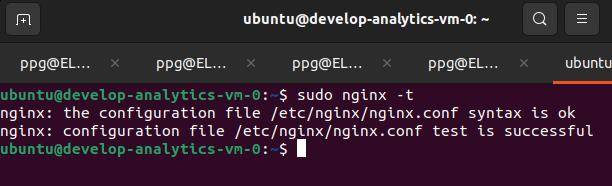

Cкриншот консоли ВМ yandex cloud с их метками:  

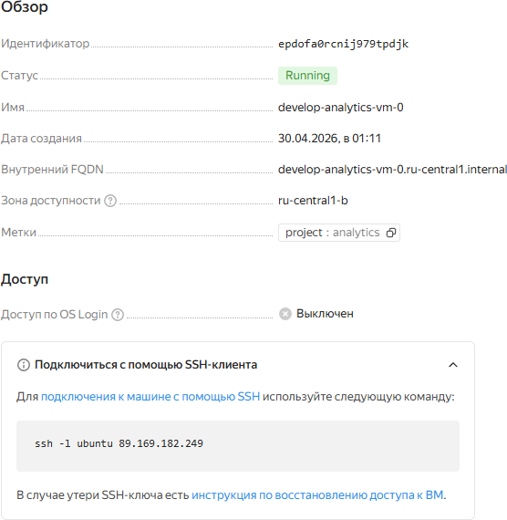

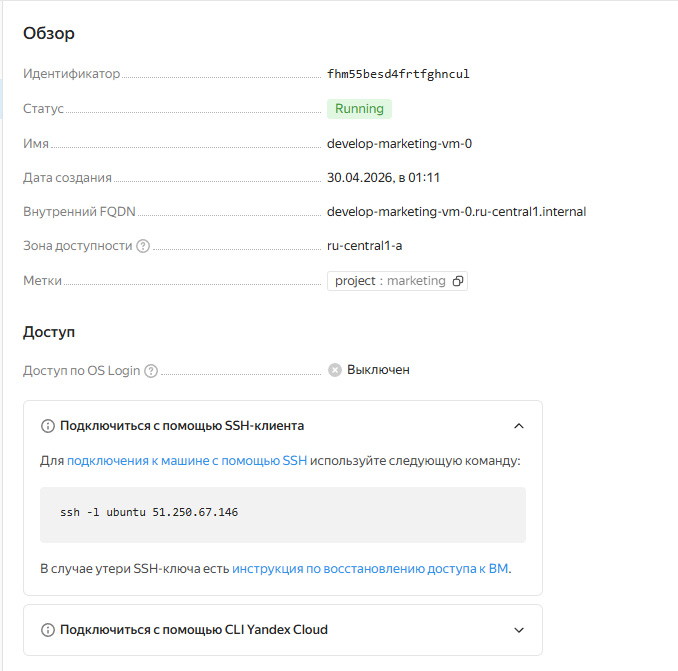

Cкриншот содержимого модуля > module.marketing_vm  

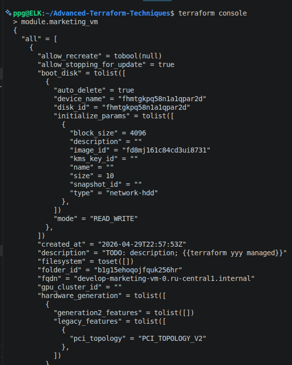

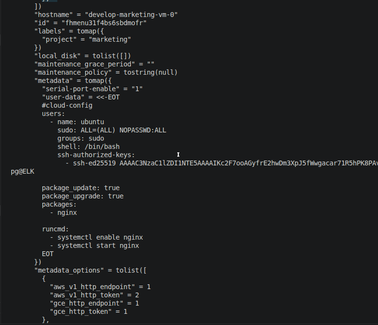

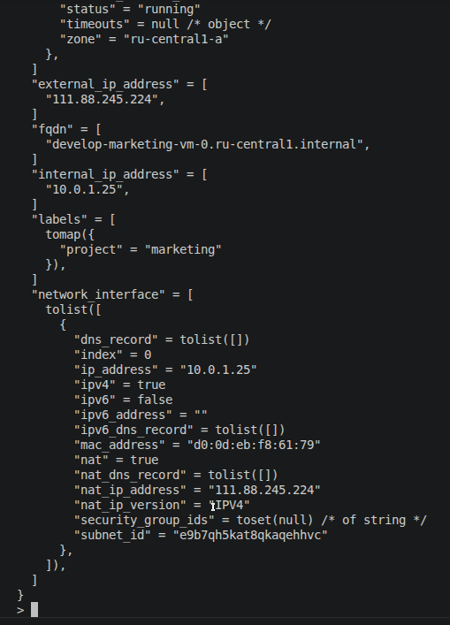

### Задание 2.

1. Напишите локальный модуль vpc, который будет создавать 2 ресурса: одну сеть и одну подсеть в зоне, объявленной при вызове модуля, например: ru-central1-a.
2. Вы должны передать в модуль переменные с названием сети, zone и v4_cidr_blocks.
3. Модуль должен возвращать в root module с помощью output информацию о yandex_vpc_subnet. Пришлите скриншот информации из terraform console о своем модуле. Пример: > module.vpc_dev
4. Замените ресурсы yandex_vpc_network и yandex_vpc_subnet созданным модулем. Не забудьте передать необходимые параметры сети из модуля vpc в модуль с виртуальной машиной.
5. Сгенерируйте документацию к модулю с помощью terraform-docs.
Пример вызова

```
module "vpc_dev" {
  source       = "./vpc"
  env_name     = "develop"
  zone = "ru-central1-a"
  cidr = "10.0.1.0/24"
}
```

### Решение 2.

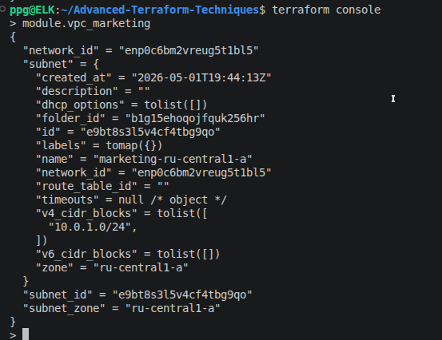

[Документация](vpc/README2.md)


### Задание 3.

1. Выведите список ресурсов в стейте.
2. Полностью удалите из стейта модуль vpc.
3. Полностью удалите из стейта модуль vm.
4. Импортируйте всё обратно. Проверьте terraform plan. Значимых(!!) изменений быть не должно. Приложите список выполненных команд и скриншоты процессы.

### Решение 3.

1. Выводим список ресурсов в state и удаляем из state весь модуль vpc:  

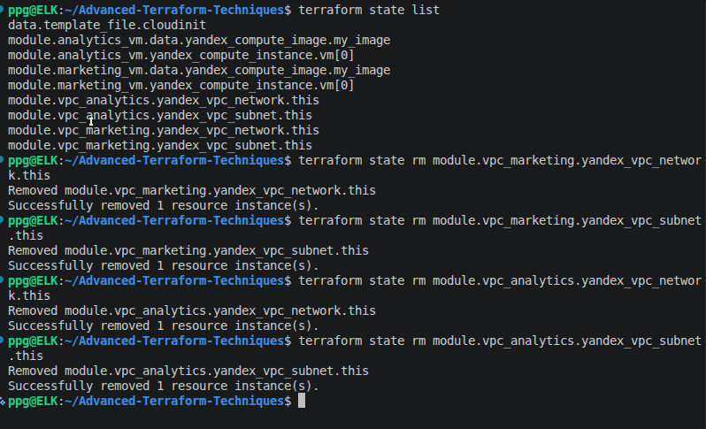

2. Удаляем все адреса, относящиеся к module.marketing_vm и module.analytics_vm  

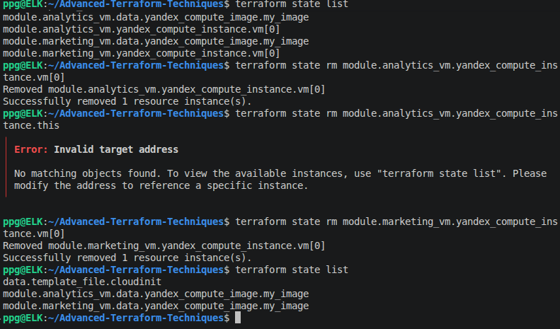

3. Смотрим ID ресурсов  

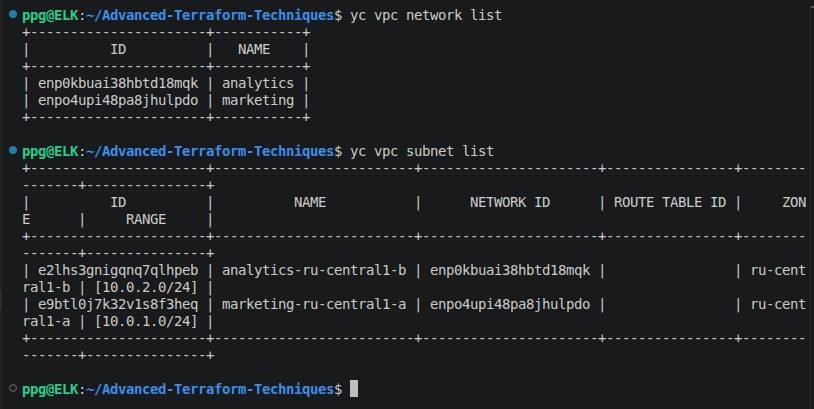

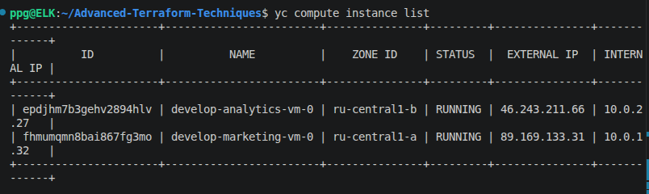

4. Импорт ресурсов модуля Marketing  

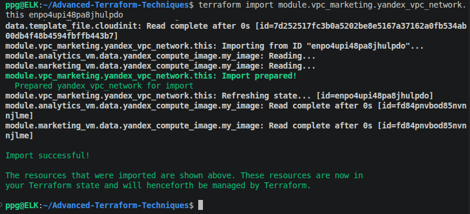

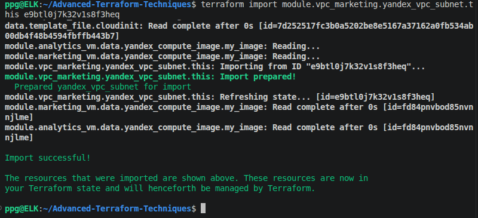

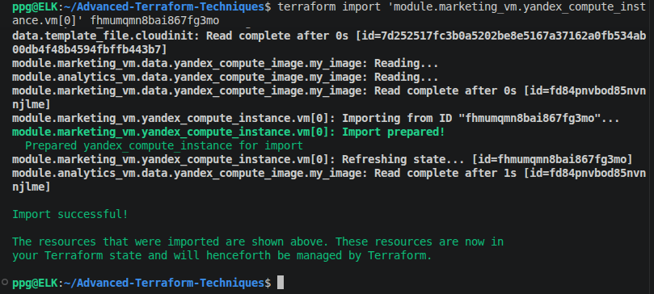

5. Импорт ресурсов модуля Analytics  

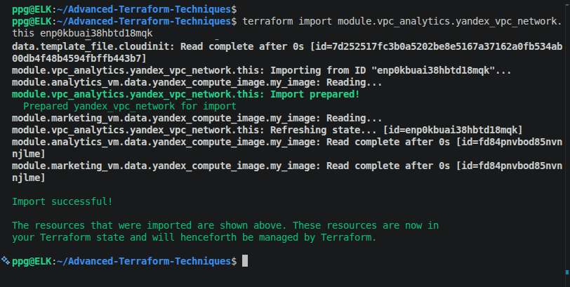

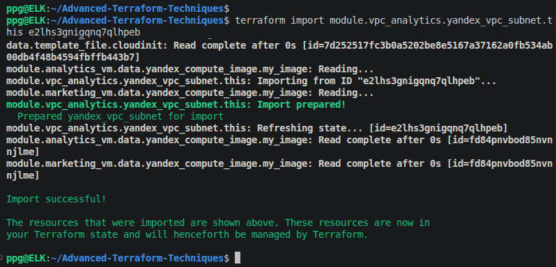

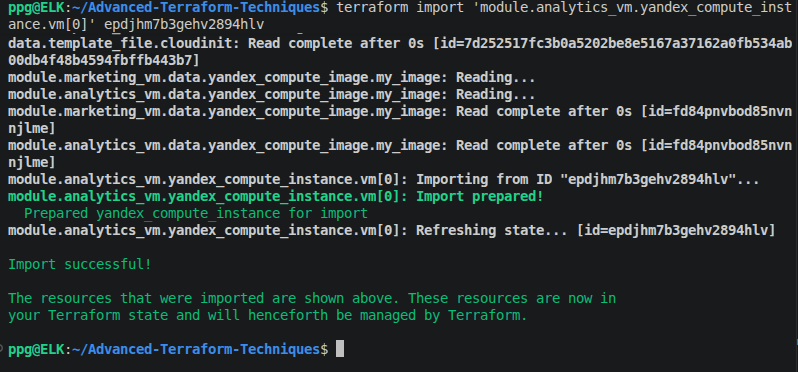

6. Проверка список ресурсов в стейте  

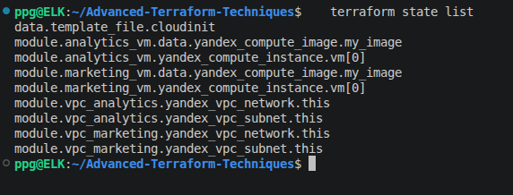

7. Проверяем изменения  

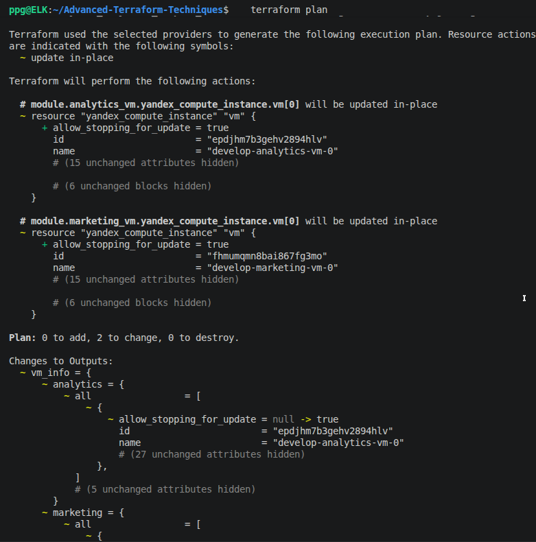

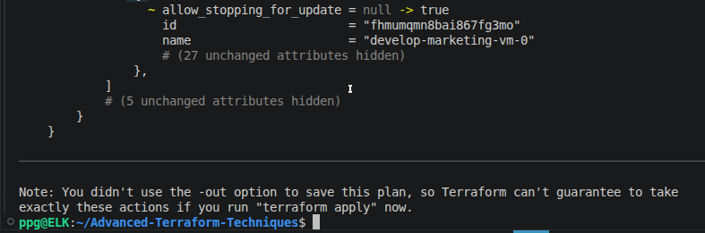

Изменение не ведет к пересозданию ресурсов и нет значимых изменений.
